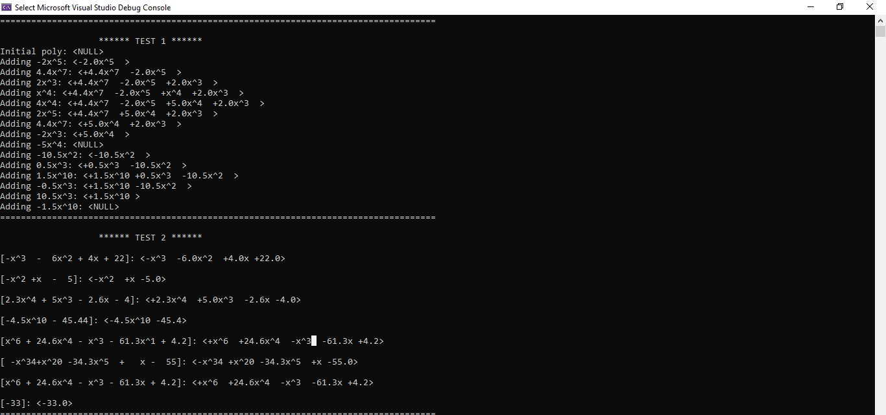
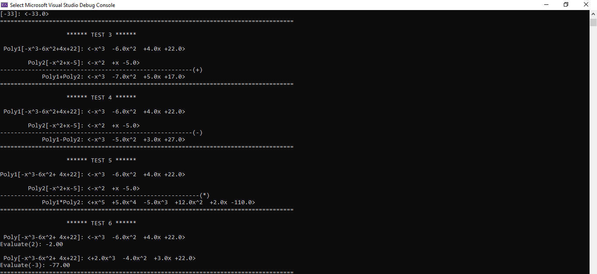
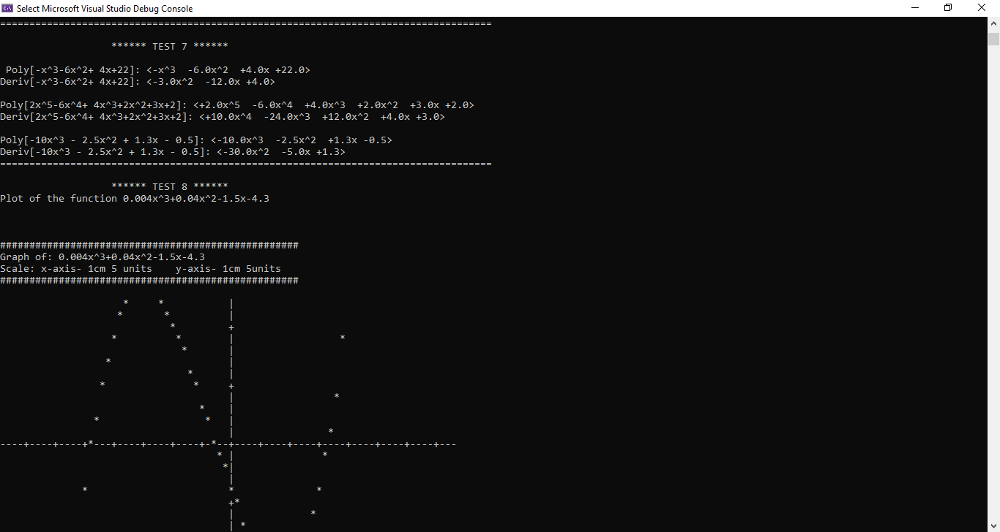

# Linked_List_Polynomials

## Prerequisites 

The project runs on a C++ Visual Studio Environment. The program can be run in other IDEs as well.
To do that successfully, the files containing the source codes can to be copied. An enlarged console screen is suitable for correct
visualization of the results computed

## About 

Program Summary - Implementations 

The program uses the Single Linked List Data Structure 

Operations:
 

1. Creates a Polynomials from a given string
2. Deletes a Polynomial 
3. Adds two or more Polynomials
4. Subtracts two or more Polynomials
5. Multiplies two or more Polynomials
6. Evaluates a given Polynomial
7. Finds a Polynomial's derivative i.e differentiates a Polynomial
8. Plots a Polynomial base on a given x1 and x2 values

For more info please find the question here[`Problem.pdf`](Problem/Problem.pdf)

## Technologies 

C/C++, Visual Studio 

## Contributor(s)

Muhammed Suwaneh

## Screenshots

### Test 1 & 2

### Test 3, 4, 5 & 6

### Test 7 & 8

